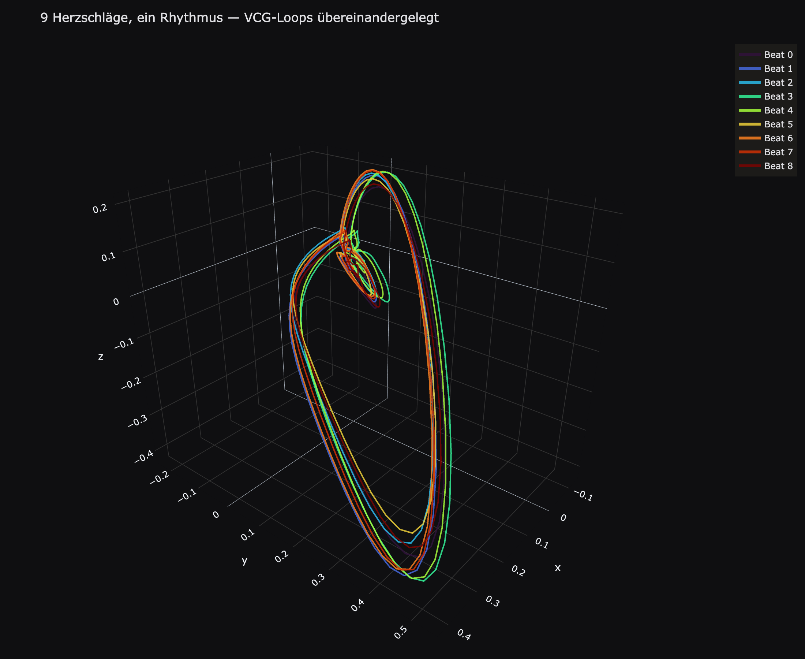

# vcgsuite

Python-Bibliothek zur EKG/VCG-Signalverarbeitung: 12-Kanal- und EASI-EKG-Aufnahmen
werden zu Vektorkardiogrammen (VCG) transformiert, R-Zacken werden erkannt, eine
Atemsurrogat (ECG-derived respiration) wird extrahiert, Beat-Landmarken werden
mittels eines Frenet-Serret-Ansatzes auf der 3D-VCG-Trajektorie annotiert,
P-/QRS-/T-Loop-Features werden berechnet, und HRV-Kennwerte werden bestimmt.

Dieses Repository ist der Umbau einer Sammlung von Jupyter-Notebook-Skripten in
ein installierbares, testbares Python-Paket.

<p align="center">
  
</p>

<p align="center"><em>Neun Herzschläge derselben Aufnahme, automatisch erkannt und übereinandergelegt — siehe <a href="examples/notebooks/00_showcase.ipynb"><code>00_showcase.ipynb</code></a> (läuft ohne eigene Daten, LUDB-Beispiel liegt bei).</em></p>

## Installation

```bash
pip install -e ".[viz,dev]"
```

- `viz` — Plotly für die Visualisierungsmodule (`vcgsuite.viz`)
- `dev` — pytest für die Test-Suite

## Schnellstart

```python
import vcgsuite as ecg

df_analysis = ecg.load_and_process(
    "pfad/zur/aufnahme.txt",
    mode="easi",          # oder "12ch"
)

df_analysis, dt = ecg.compute_vcg_kinematics(df_analysis)
r_peak_times, _ = ecg.detect_r_peaks(df_analysis)
r_turn_times, _ = ecg.detect_r_turn(df_analysis, r_peak_times)

df_annotations = ecg.annotate_all_beats(df_analysis, r_peak_times, r_turn_times)
df_r = ecg.compute_beat_rotation(df_annotations, df_analysis)
```

## Modulübersicht

| Modul | Inhalt |
|---|---|
| `vcgsuite.io` | Laden von EASI- und 12-Kanal-Rohdaten (`load_easi`, `load_ecg12`) |
| `vcgsuite.preprocessing` | ZapLine (Netzfrequenz) + FIR-Filterpipeline |
| `vcgsuite.transform` | EASI→Frank-XYZ und 12-Kanal→Frank-XYZ (IDT/KORS/QLSV/PLSV) |
| `vcgsuite.pipeline` | Ende-zu-Ende-Orchestrator (`load_and_process`) |
| `vcgsuite.kinematics` | Frenet-Serret-Kinematik (Geschwindigkeit, Krümmung, Torsion) |
| `vcgsuite.detection` | R-Peak- und R-Turn-Detektion |
| `vcgsuite.annotation` | Hierarchische Beat-Landmark-Annotation |
| `vcgsuite.beats` | Beat-zu-Beat-Rotation, komplexe Amplitude, VLS |
| `vcgsuite.features.loop` | P-/QRS-/T-Loop-Geometrie-Features + Merge |
| `vcgsuite.hrv` | RR-Aufbereitung, HRV-Kennwerte, EDR-Extraktion |
| `vcgsuite.viz` | Plotly-Visualisierungen (getrennt von der Berechnungslogik) |

## Beispiel-Notebooks

In `examples/notebooks/`:

0. [`00_showcase.ipynb`](examples/notebooks/00_showcase.ipynb) — die Kurzversion:
   ein LUDB-Beispielrecord liegt bei, keine eigenen Daten nötig, läuft in
   Sekunden durch. R-Peak-Erkennung, Beat-Annotation, 3D-VCG-Trajektorie,
   Multi-Beat-Overlay, HRV — in wenigen Zellen.
1. [`01_load_filter_annotate_visualize.ipynb`](examples/notebooks/01_load_filter_annotate_visualize.ipynb) — ausführlicher, gegen eine eigene Aufnahme (`sample_data/`, lokal, nicht versioniert): Laden, Filtern, VCG-Transformation, Kinematik, R-Peak-Erkennung, Beat-Annotation, 2D-/3D-Visualisierung
2. [`02_feature_extraction.ipynb`](examples/notebooks/02_feature_extraction.ipynb) — P-/QRS-/T-Loop-Features, HRV-Kennwerte, EDR

Ein drittes Notebook zur Aktivierungskarten-Berechnung (Herzmesh + Body-Surface-Potential)
folgt in einer späteren Version, zusammen mit dem entsprechenden `vcgsuite.activation`-Modul.

Zum Ausführen: `pip install -e ".[viz,notebooks]"`, dann
`jupyter lab examples/notebooks/`. Pfad zur Beispieldatei ggf. in der
jeweils ersten Code-Zelle anpassen.

## Wissenschaftliche Validierung

[`notebooks/ludb_validation.ipynb`](notebooks/ludb_validation.ipynb) — Validierung
des Beat-Annotationsalgorithmus gegen die [LUDB](https://physionet.org/content/ludb/1.0.1/)
(PhysioNet), nach dem Evaluationsprotokoll aus Emrich et al., *"Physiology-Informed
ECG Delineation Based on Peak Prominence"* (150 ms Toleranzfenster, Se/PPV/F1,
Fehler-Statistik pro Wellentyp). Läuft schrittweise (Datenexploration →
Annotation-Parsing → Algorithmus-Integration → Metrik).

[`notebooks/ludb_tuning.ipynb`](notebooks/ludb_tuning.ipynb) — Retuning der
Fenster-/Feature-Strategien anhand der LUDB-Ground-Truth (record-level
Train/Test-Split + 5-fach-CV; deterministisches Tuning + RF-Hybrid je Marker),
baut auf der Baseline aus `ludb_validation.ipynb` auf. Enthält außerdem zwei
Analysen dazu, ob ein Teil der P-/T-Wellen-Schwäche auf Lead-zu-Lead-
Uneinigkeit in der LUDB-Ground-Truth selbst zurückgeht statt auf den
Algorithmus (gepoolte Konsens-GT-Bewertung, Lead-Spread-vs-Detektionsfehler-
Korrelation) — eine offene, noch nicht abschließend geklärte Hypothese, hier
als Zwischenstand dokumentiert.

Zum Ausführen: `pip install -e ".[viz,notebooks,validation]"` — die
`validation`-Gruppe installiert `wfdb` (PhysioNet-Rohdaten), `scikit-learn`/
`joblib` (RF-Hybrid-Teil). Erwartet die LUDB-Rohdaten lokal unter
`<Projektordner>/lobachevsky-university-electrocardiography-database-1.0.1/`
(wie `sample_data/` nicht versioniert), gemeinsame Hilfsfunktionen in
[`notebooks/ludb_common.py`](notebooks/ludb_common.py).

## Ausführliche Dokumentation

- [`docs/vcg_analysis_pipeline.md`](docs/vcg_analysis_pipeline.md) — Laden, Filtern, VCG-Transformation
- [`docs/vcg_beat_annotation.md`](docs/vcg_beat_annotation.md) — Frenet-Serret-Beat-Annotation, Fenstergrenzen

## Herkunft & bekannte Einschränkungen

Dieses Paket wurde aus einer Sammlung von Notebook-Export-Skripten migriert.
Dabei wurden mehrere Probleme des Originals behoben (siehe Kommentare in den
jeweiligen Modulen für Details): dreifach duplizierte Loop-Feature-Helfer
wurden zu einer Version konsolidiert, mehrere leicht unterschiedliche
SavGol-Glättungs-Wrapper wurden zu `vcgsuite.signal_utils.savgol_smooth`
vereinheitlicht, eine im Code fehlende `gaussian_filter1d`-Import wurde
ergänzt, hartcodierte personenbezogene Dateipfade wurden durch Funktions-
parameter ersetzt, und die verwaiste `WINDOWS_LOCAL`-Konstante wurde durch
die tatsächlich verwendeten `HIERARCHICAL_WINDOWS` ersetzt.

Bekannte, bewusst nicht aufgelöste Einschränkungen:

- `theta_P_QRS` (P-Loop) und `theta_QRS_P` (QRS-Loop) werden über zwei
  unabhängige SVD-Berechnungen bestimmt und können leicht divergieren
  (siehe `TODO`-Kommentare in `features/loop/p_wave.py`/`qrs_complex.py`).
- Der vektorisierte Fast-Path für die lokale Std-Abweichung in
  `kinematics.frenet_serret._local_stat` weicht bei **konstanten** Signalen
  durch Gleitkomma-Auslöschung (Präfixsummen-Formel) leicht vom exakten
  Referenzwert 0.0 ab — für reale (nicht-konstante) Signale unauffällig,
  als `xfail` in `tests/test_kinematics.py` dokumentiert, noch ungefixt.

## Tests

```bash
pip install -e ".[dev]"
pytest
```

Ein Teil der Tests ist ein echter End-to-End-Durchlauf (Laden → Filtern →
VCG-Transformation → Kinematik → R-Peak-Erkennung → Annotation → Loop-Features
→ HRV) auf einer realen EASI-Beispielaufnahme. Diese Rohdaten sind **nicht**
Teil des Repositories (personenbezogene Gesundheitsdaten) und müssen lokal
unter `<Projektordner>/sample_data/` abgelegt werden — ist die Datei nicht
vorhanden, werden die betroffenen Tests automatisch übersprungen (z. B. in
CI/auf GitHub). Reine Unit-Tests (z. B. `test_utils.py`) laufen immer, auch
ohne Beispieldaten.

## Zitieren

Siehe `CITATION.cff`. Für eine dauerhafte, versionsgebundene DOI empfiehlt
sich eine Verknüpfung des GitHub-Repos mit Zenodo bei jedem Release.

## Lizenz

MIT — siehe `LICENSE`.
